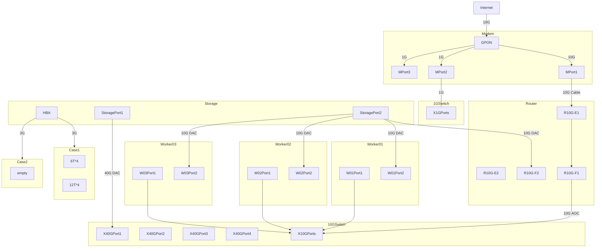

# 家用服务器集群问题

最近捡破烂捡到了一组服务器，想了想既有的基础设置（HP Micro Server Gen8）其实满弱的正好升（折）级（腾）一下喵~

~~然后电表就炸了喵~~

## 系统结构

因为是家用 Bear Metal 服务器结构，加上家用有NAS等需求，结果就是这样一大堆东西喵：

```mermaid
flowchart TB
  Internet--10G-->GPON
  subgraph 10GSwitch
    X40GPort1
    X40GPort2
    X40GPort3
    X40GPort4
    X10GPorts
  end
  subgraph 1GSwitch
    X1GPorts
  end
  subgraph Modem
   GPON--10G-->MPort1
   GPON--1G-->MPort2
   GPON--1G-->MPort3
  end
  subgraph Router
    MPort1--10G Cable-->R10G-E1
    R10G-E2
    R10G-E1-->R10G-F1--10G AOC-->X10GPorts
    R10G-F2
  end
  subgraph Storage
    HBA
    StoragePort1
    StoragePort2
  end
  subgraph Case1
    zones:[6T*4]
    usb:[12T*4]
  end
  subgraph Case2
    empty
  end
  subgraph Worker01
    W01Port1-->X10GPorts
    W01Port2
  end
  subgraph Worker02
    W02Port1-->X10GPorts
    W02Port2
  end
  subgraph Worker03
    W03Port1-->X10GPorts
    W03Port2
  end

  HBA--3G-->Case1
  HBA--3G-->Case2

  MPort2--1G---X1GPorts
  StoragePort2--10G DAC-->R10G-F2
  StoragePort2--10G DAC-->W01Port2
  StoragePort2--10G DAC-->W02Port2
  StoragePort2--10G DAC-->W03Port2
  StoragePort1--40G DAC-->X40GPort1

```
